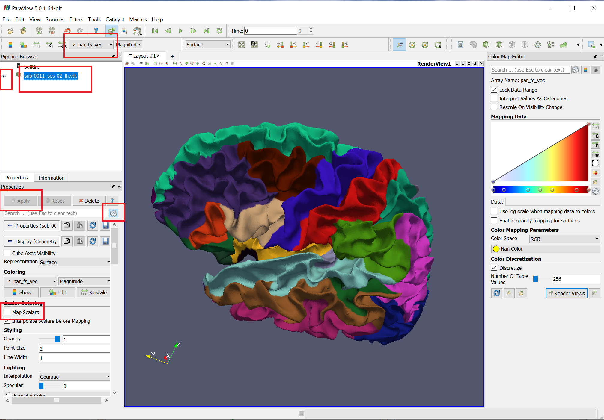

# Visualize the surface and ROI
Our reconstructed cortical surface is mainly in ```vtk``` format. You can directly load them into the __[paraview](https://www.paraview.org/)__ to visualize. I attached a screen shot in the appendix and marked the key settings with red box. To visualize the ROI, you can simply following the following screenshot settings.


# Getting the ROI feature

After the pipeline processing, we have the surface files named as ```subjectname.InnerSurf.WithPar.vtk```. In this file, the cortical thickness and vertex area is provided; Also, the popular Freesurfer parcellation label is also attached. 

You can visualize this surface using __[paraview](https://www.paraview.org/)__ by simply load the surface in it. 

The surface file we provided is a legacy ascii vtk file, which is created by the [kitware](https://www.kitware.com/). You can get the detailed illustration of the vtk file format in __[vtk file format](https://vtk.org/wp-content/uploads/2015/04/file-formats.pdf)__.

To facilitate the operation over the results, I shared a matlab toolkit named ```mvtk```. The ```mvtk``` is originally contributed to Guillaume Flandin __[mvtk original](https://www.artefact.tk/software/matlab/mvtk/)__. Because its original version only support single point-wise attribute, I did some modifications to extend it for supporting multiple point-wise attributes. Basically, there are two major read and write functions, i.e., the ```mvtk_read``` and ```mvtk_write```. 

To get the ROI feature, you can use the ```mvtk_read``` to read the corresponding surface file like:
```matlab
pVTK=mvtk_read('surface_file');
```
After reading, the ```pVTK``` is a struct, which contains several fields. The ```vertices``` contains the x-y-z coordinates of each vertex on the surface. The ```faces``` contains the triangles that forms the surfaces. Generally, you can also get the ```thickness``` and ```vertexArea``` field, which stores the point-wise thickness and area of each vertex on the cortical surface. Also, there are some parcellations. For each parcellation, it consists of two fields, the typical one is ```par_fs``` and ```par_fs_vec```. The ```par_fs``` is a $$M \times 1$$ vector, where $$M$$ is the vertex number. Each component is a very large integer, which represents the id of the ROI. The ```par_fs_vec``` is a $$M \times 3$$ matrix, where each row represents the RGB color to show this ROI.  

The typical Freesurfer parcellation ROI label name and its corresponding id and RGB color is listed in the file ```FreesurferLabelName.csv```, which is also included in this repository. 

The typical code to get the average thickness of the ```Left Fusiform``` is like the following:
```matlab
pVTK=mvtk_read('surface_file');
pThickness=pVTK.thickness;
pFSROI = pVTK.par_fs;
pFusiform_vertex_idx_set=find(pFSROI==9231540) % Get the ROI name and id mapping in FreesurferLabelName.csv.
pFusiform_mean_thickness=mean(pThickness(pFusiform_vertex_idx_set));
```

For other ROIs, you can use the similar code by changing the ROI ID, where all freesurfer parcellation ROI id can be found in ```FreesurferLabelName.csv```. 